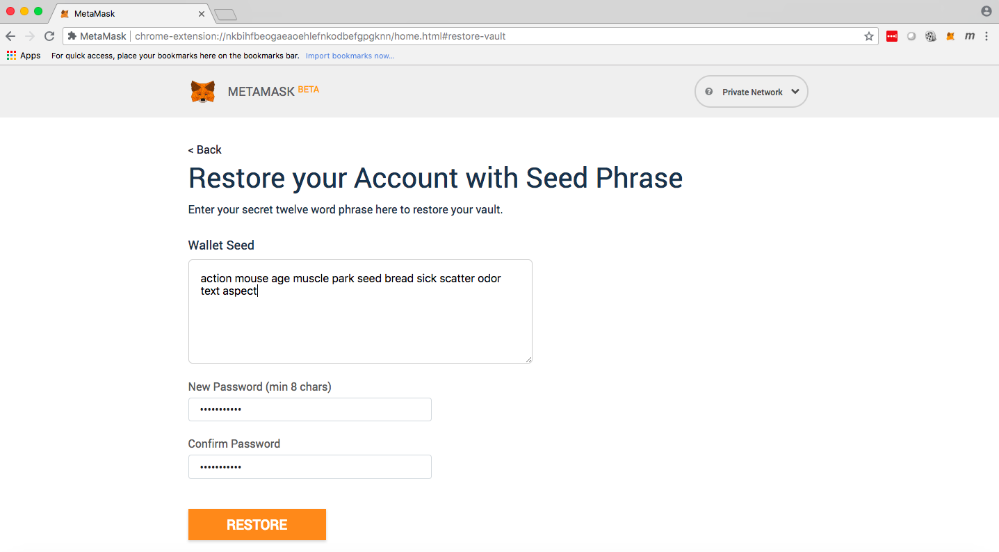
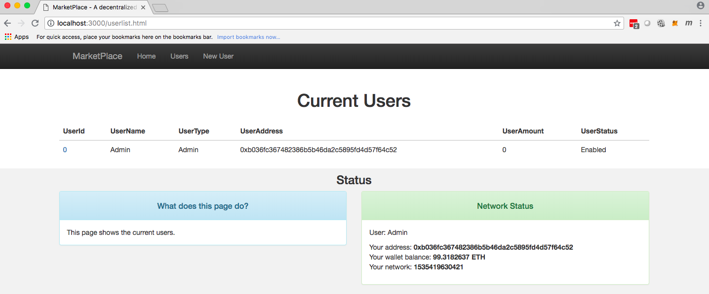
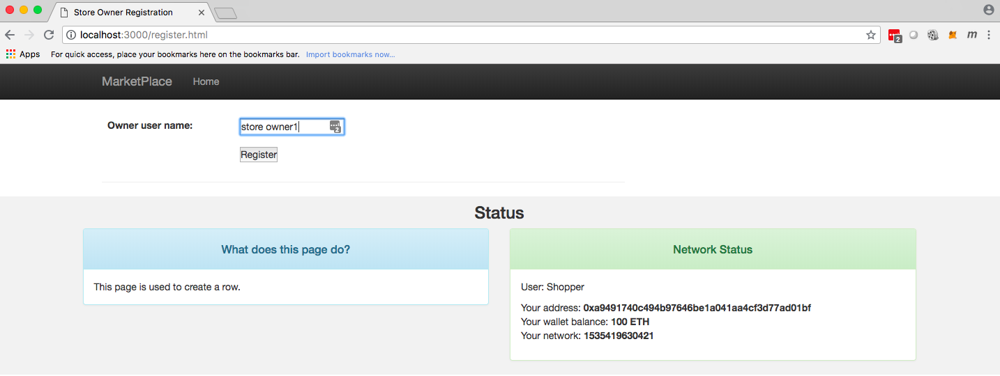
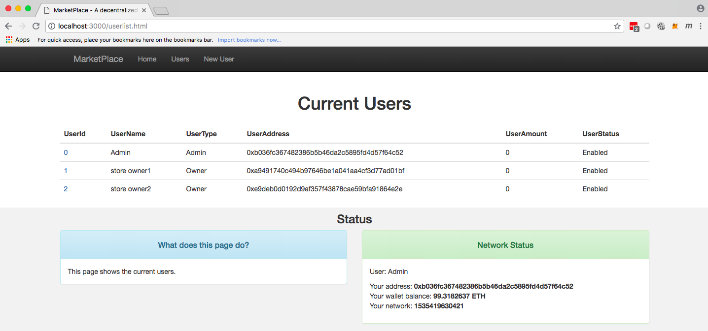
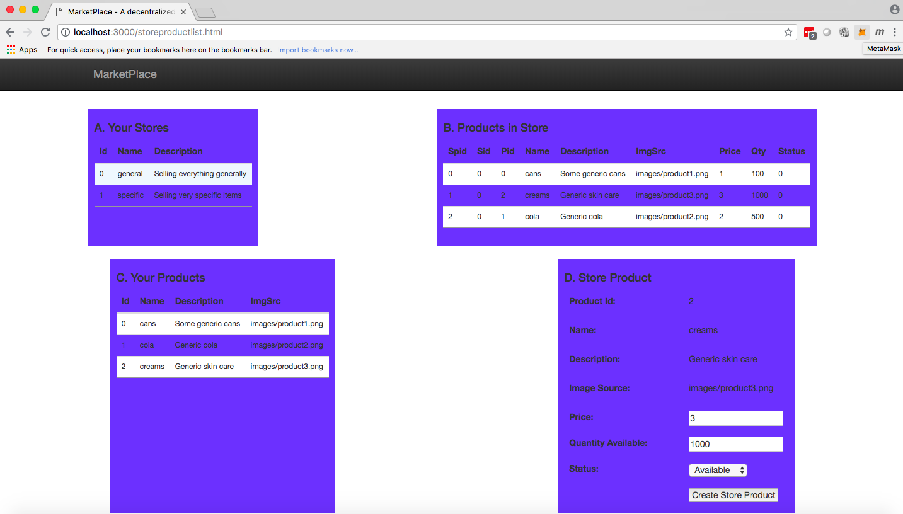

# README.md for MarketPlace

This application accompanies the book, 
[AI, IoT and the Blockchain: Using the Power of Three to create Business, Legal and Technical Solutions](https://www.amazon.com/AI-IoT-Blockchain-Technical-Solutions-ebook/dp/B081TMHN5D)

## What does the MarketPlace do?

MarketPlace is a DApp (decentralized application) that allows store owners to create stores and products and add products to stores and make them for sale to shoppers. 

When the "smart contract" code is deployed an initial 'administrator' user is created and set to the address of the deployer. This administrator can update the user type (Admin, Owner) and status of users (Enabled, Disabled). All user access and permissioning is determined by the currently logged in user within the MetaMask plugin. A MetaMask user (except the Admin user) can register as a store owner. Store owners can create one or more stores. Store owners can also create one or more products.  For each store, the store owner can add from their list of products and set the amount of inventory and price for that store. Any other type of user is designated as a Shopper (shoppers logged in to a MetaMask account) for the marketplace. The Shopping menu shows a list of stores and their description. They can then choose a store and see a list of the products available in that store. A Shopper can then choose to purchase a product by clicking on the Buy button within the store. When they purchase a product, an order is created, the store product quantity available is decreased and the Shopper MetaMask wallet is debited by the store price of item purchased. The store owner's account is also credited for the price of the purchased item. In the marketplace contract there are entities and relationship represented by solidity structures. These include users, stores, products, store products and orders.


## Part A: How to set up the MarketPlace

MarketPlace is a truffle project that can run on a local development server. The project requires that Truffle is installed. See https://truffleframework.com/docs/truffle/getting-started/installation for details.

### A.1: Download node modules

Open a command prompt, navigate to the downloaded project and run the following command:
```
$ npm install
```

The above command will download all of the node modules that are required by the application. Here is an example output the above command:

```
> fsevents@1.2.9 install /.../Ch11-MarketPlace-0.5/node_modules/fsevents
> node install

node-pre-gyp WARN Using needle for node-pre-gyp https download 
[fsevents] Success: "/.../Ch11-MarketPlace-0.5/node_modules/fsevents/lib/binding/Release/node-v64-darwin-x64/fse.node" is installed via remote
npm WARN marketplace@1.0.0 No repository field.

added 417 packages from 566 contributors and audited 3589 packages in 13.499s
found 0 vulnerabilities
```

### A.2: Compilation

Open a command prompt, navigate to the downloaded project and run the following command:
```
$ truffle compile
```

### A.3: Start local blockchain

In order to migrate and run the contract, you must first create a local private blockchain network. To do so, open a second command prompt and run the following command:

```
$ ganache-cli -p 9545
```

The above command will among other things, output a list of available accounts, their private keys and a mnemonic phrase that should be copied and used later. Here is an example output from the ganache-cli tool

```
Ganache CLI v6.4.3 (ganache-core: 2.5.5)

Available Accounts
==================
(0) 0xc222255fd265f8cd2a928766eaa039718ce65a5c (~100 ETH)
(1) 0x76ce2da46c6535a2ae1dc5b2f09b2301915e9a94 (~100 ETH)
(2) 0xeaac174e1ec5ec7e31f95df56d4ee66307a25a25 (~100 ETH)
(3) 0x992f2e2ea6274e80c730617a181eec6d46386385 (~100 ETH)
(4) 0x9ba33c2a557186ea45df432150aa7cceb146722c (~100 ETH)
(5) 0x26728221a8616c11e52f334536492ca2b853879e (~100 ETH)
(6) 0xe8350fbbf8beb23a55b53c543e04c8c24b1de36f (~100 ETH)
(7) 0xbf31785f39d7560c767263a9fa93bb741281fe0a (~100 ETH)
(8) 0x43e33e5dfd3cc9ff2dc6b8df1c51eebeaea662d0 (~100 ETH)
(9) 0xff326e561dae1fb2a5e2fe98bd367ad01e9e493b (~100 ETH)

Private Keys
==================
(0) 0xfa39aa7ecadb4f2fd1178aa2535609b8b69c393c12202ae295abfead3a55426a
(1) 0xf29d73c5b56fedfb775897956c08da4e3cbc0658aec5c25f35c0f5b47e92d6ec
(2) 0x71221dc8971b0f7d9776d920ea93fe5d825493384b912687f4cd5ccf996a769c
(3) 0x77baa2b1cc4c0a4c38cd78c2af1e38cba627bffcd670be692232f1405566d556
(4) 0x53c8015a1eb6b3a9717e96c3fd9aabe60689433cccd7ead2ace7c8f1e56c5926
(5) 0xeaf3d501c70c45387be12085ecdb36849979f5cb30ead5854a7732afdcc477d3
(6) 0x1b37e5de2aaccb8a1a59afdb4b3102cc294269bafe535259a672fb0a77378753
(7) 0xee881c40ee30bb085ae42df7cb290edb60ebf5b2d569fe467e7c5ac03f4de3c9
(8) 0x4da5008a713fa9db3d235900e2f448f9a8cee9852a7fc3046386951a59a0d336
(9) 0xb68bc8a211da0483b1b5209e675d2716aecccc4676fba99b82361ca14eec1ede

HD Wallet
==================
Mnemonic:      match test sustain destroy type coin coconut modify demand spike tilt motor
Base HD Path:  m/44'/60'/0'/0/{account_index}

Gas Price
==================
20000000000

Gas Limit
==================
6721975

Listening on 127.0.0.1:9545
```

### A.4: Migrate and deploy contract

The next step is to migrate the MarketPlace contracts to the local private blockchain listening on port 8545 (see ganache-cli output). Type the following into a command prompt for the root directory of the download:
```
$ truffle deploy
```
The output from the above command should look something like the following:
```
Compiling your contracts...
===========================
> Everything is up to date, there is nothing to compile.


Starting migrations...
======================
> Network name:    'development'
> Network id:      1562417149124
> Block gas limit: 0x6691b7


1_initial_migration.js
======================

   Deploying 'Migrations'
   ----------------------
   > transaction hash:    0x0bbff9cb13c2547041a213ad342044a49abb9756d2b29c3afcf61b926e8eae88
   > Blocks: 0            Seconds: 0
   > contract address:    0xAA19C2960dd44982E7FC4b85399Af14701758bC3
   > block number:        1
   > block timestamp:     1562417164
   > account:             0xc327920A5116364CB68933e03456287512CcF0E2
   > balance:             99.99477214
   > gas used:            261393
   > gas price:           20 gwei
   > value sent:          0 ETH
   > total cost:          0.00522786 ETH


   > Saving migration to chain.
   > Saving artifacts
   -------------------------------------
   > Total cost:          0.00522786 ETH


2_deploy_contracts.js
=====================

   Deploying 'DMPExtra'
   --------------------
   > transaction hash:    0x007b5e9a5e3bfc3a72598d614c8e6ef88afb28684160d956bffbd04755308e02
   > Blocks: 0            Seconds: 0
   > contract address:    0xFdBBe0Aa92cBA02093e64E501Ff41650EC1f4c3a
   > block number:        3
   > block timestamp:     1562417164
   > account:             0xc327920A5116364CB68933e03456287512CcF0E2
   > balance:             99.95717758
   > gas used:            1837705
   > gas price:           20 gwei
   > value sent:          0 ETH
   > total cost:          0.0367541 ETH


   Deploying 'MarketPlace'
   -----------------------
   > transaction hash:    0x34b1899d1cd8faaa665beb2cbf6726fec9b3f19648298bf809ce249a2da523b2
   > Blocks: 0            Seconds: 0
   > contract address:    0xbc9484D4235D77C27C6A2B14250cba6990bD6D9D
   > block number:        4
   > block timestamp:     1562417164
   > account:             0xc327920A5116364CB68933e03456287512CcF0E2
   > balance:             99.8235758
   > gas used:            6680089
   > gas price:           20 gwei
   > value sent:          0 ETH
   > total cost:          0.13360178 ETH


   > Saving migration to chain.
   > Saving artifacts
   -------------------------------------
   > Total cost:          0.17035588 ETH


Summary
=======
> Total deployments:   3
> Final cost:          0.17558374 ETH
```

### A.5: Run tests

All of the test cases for the MarketPlace are held in the test directory. From a command prompt in the root of the downloaded directory, run the following command:

```
$ truffle test
```

The output from the above command should look something like the following:

```
Compiling your contracts...
===========================
> Compiling ./contracts/DMPExtra.sol
> Compiling ./contracts/MarketPlace.sol
> Compiling ./contracts/Migrations.sol
> Compiling openzeppelin-solidity/contracts/math/SafeMath.sol
> Compiling openzeppelin-solidity/contracts/ownership/Ownable.sol
> Artifacts written to /var/folders/q1/nqwsplnj6wqfs0gg8jym6dlw0000gt/T/test-11966-10161-1hrh3i2.hy31
> Compiled successfully using:
   - solc: 0.5.8+commit.23d335f2.Emscripten.clang


  Contract: MarketPlace - fallback works
    ✓ should revert ether sent to this contract through fallback (85ms)

  Contract: MarketPlace - withdraw full amount
    ✓ should register a store owner (187ms)
    ✓ should create and send funds to store (149ms)
    ✓ should withdraw all funds from store (95ms)

  Contract: MarketPlace - withdraw higher amount, then full amount
    ✓ should register a store owner (115ms)
    ✓ should create and send funds to store (138ms)
    ✓ should withdraw too much from store, leave store balance intact (91ms)
    ✓ should withdraw all funds from store (repeat) (101ms)

  Contract: MarketPlace - start to finish ecommerce
    ✓ should register a store owner (114ms)
    ✓ should create and send funds to store (134ms)
    ✓ should create a product (139ms)
    ✓ should create a store product (175ms)
    ✓ should sell a store product (201ms)
    ✓ should withdraw sale proceeds from store (112ms)
    ✓ should withdraw too much from store, leave store balance intact (86ms)
    ✓ should withdraw all funds from store (repeat) (92ms)


  16 passing (2s)
  ```

### A.6: Start the web application

To do so, open a third command prompt and run the following command:

```
$ npm run dev
```

The above command will create something like the following output:

```
> marketplace@1.0.0 dev /.../Ch11-MarketPlace-0.5
> lite-server

** browser-sync config **
{ injectChanges: false,
  files: [ './**/*.{html,htm,css,js}' ],
  watchOptions: { ignored: 'node_modules' },
  server:
   { baseDir: [ './src', './build/contracts' ],
     middleware: [ [Function], [Function] ] } }
[Browsersync] Access URLs:
 ------------------------------------
       Local: http://localhost:3000
    External: http://192.168.1.8:3000
 ------------------------------------
          UI: http://localhost:3001
 UI External: http://localhost:3001
 ------------------------------------
[Browsersync] Serving files from: ./src
[Browsersync] Serving files from: ./build/contracts
[Browsersync] Watching files...
```

At this point, a browser should open at [http://localhost:3000](http://localhost:3000) and you will see a screen that looks like this:

")

Note that the above screen also show the MetaMask plugin prompting for wallet login.

## Part B: How to use the MarketPlace

Now that you have the MarketPlace compiled, deployed and running on a local blockchain network, you are now ready to try out the user interface.

### B.1 Establishing MetaMask

In order to use the MarketPlace you will need to install and set up the MetaMask browser plugin. MetaMask will be used to select accounts from the list of the ten (10) accounts that are automatically generated in the local blockchain network. These accounts will be used in the sections below to represent an Administrators, Store Owners and Shoppers. To start with, open the MetaMask browser plugin and, if necessary, log out of any current wallet before proceeding to the restore from wallet seed function.

### B.2 Restore MetaMask from Wallet Seed

Open the MetaMask plugin and click link that says ```Import using account seed phrase```. This will open the plugin home page for MetaMask, again click on the ```Import using account seed phrase``` link. This will open the Restore your Account with Seed Phrase page. Enter in the mnemonic that was output from ganache-cli in Step 3 above (in example above this phrase is: ```match test sustain destroy type coin coconut modify demand spike tilt motor```). Enter the New Password and Confirm Password fields and click Restore button. 



Once you've restored the wallet, make sure you are still pointing to the local network by clicking on the dropdown labeled "Private Network" and re-selecting Localhost 8545.

### B.3 Setup MetaMask accounts

Once you've restored from the Wallet Seed in prior step, you will have a single account set up (named Account 1 by default) that uses the 1st address of the ten (10) accounts set up by ganache-cli in Step 3 above. Now you go ahead and create three (3) more accounts (for a total of 4). Each time that you click on Create Account within the MetaMask plugin, it will create an account and associate it with the next available account within the list of ten (10) known accounts.


Once you've create three (3) more accounts, choose Account 1 again, then open the home page [http://localhost:3000](http://localhost:3000) and you will see that you are an Administrator (see "Admin" below MarketPlace text in middle of screen). Click on Users menu item and you will see the admin user that was created by contract constructor.



Go back to MetaMask plugin and choose Account 2, then open the home page [http://localhost:3000](http://localhost:3000) and you will see that you are classified as a Shopper. Click on Register menu item and fill in the user name and click on the Register button. MetaMask will prompt you to confirm the transaction. 



Once register function is complete, refresh the home page and you will now see that you are classified as a store Owner.

Go back to MetaMask plugin and choose Account 3, then open the home page [http://localhost:3000](http://localhost:3000) and again you will see that you are classified as a Shopper. Click on Register menu item and fill in the user name and click on the Register button. MetaMask will prompt you to confirm the transaction. Once complete, refresh the home page [http://localhost:3000](http://localhost:3000) and you will now see that you are classified as another store Owner.


Go back into MetaMask and choose Account 1, then return to the home page [http://localhost:3000](http://localhost:3000) and click on the the Users menu item to see the list of current users. It should look something like this:



Using the MetaMask plugin, log in as owner 1 (Account 2) and create two stores. The project comes with three (3) pre-loaded store images that you can use (images/store1.png, images/store2.png, images/store3.png). You can also use external internet images by specifying the complete http(s) link reference. After creating the stores click on the Stores menu link and view the list of stores for owner 1 (Account 2). Log in as owner 2 (Account 3) and create some aone or more additional stores. After creating any stores, you can click on the Stores link to view the list of stores for the currently logged in owner. Below is an example of the Stores list.


Again using the MetaMask plugin, ensure you are logged in as owner 1 (Account 2) and create products. The project comes with five (5) pre-loaded product images that you can use (images/product1.png through images/product5.png), or you can use a reference to a public image, e.g., https://encrypted-tbn0.gstatic.com/images?q=tbn:ANd9GcRvR00a9LQbFTislQXT1nJjOrAIOiMbm6i1dsyRlPtoi2Ab0uHA. Below is an example product create page.


Once you have created some products, you can list out the products associated with the logged in user by clicking on the Products menu item. The following is an example of the Products list page.


The next step in the store set up process is to associate products with stores and set the quantity and price of the product for a given store. The following is an example of the Store Products maintenance page showing a store being selected and a product being added.


The following is Store Products list showing multiple products added to store.



Once a store owner has configured the products for their stores, the next step is to log in as a shopper and start looking for and buying merchandise. To do this, open the MetaMask plugin and switch to Account 4. This is not associated with any user in the system, so it will default to a Shopper role. Open the home page [http://localhost:3000](http://localhost:3000) to confirm the Shopper role, then click on the Shopping link to show the list of stores that are in the MarketPlace. The following is a page showing multiple stores in the MarketPlace.


As a Shopper, you can enter a store from the store list and choose to buy any of the products listed. The following depicts a product that is chosen.


The only remaining functionality is the withdraw function. Using MetaMask, log in as Account 2, open the home page [http://localhost:3000](http://localhost:3000) and click on Stores, select a store and press the Withdraw button. This will withdraw the funds from the store and place them into the wallet of the logged in user (Account 2). Below is an example of the Store page and the withdraw button:

